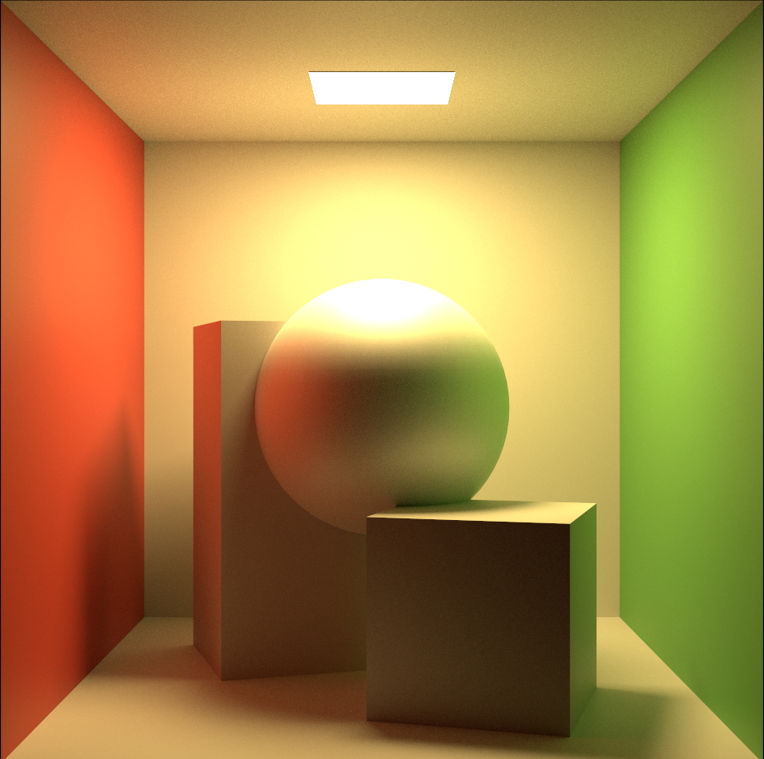
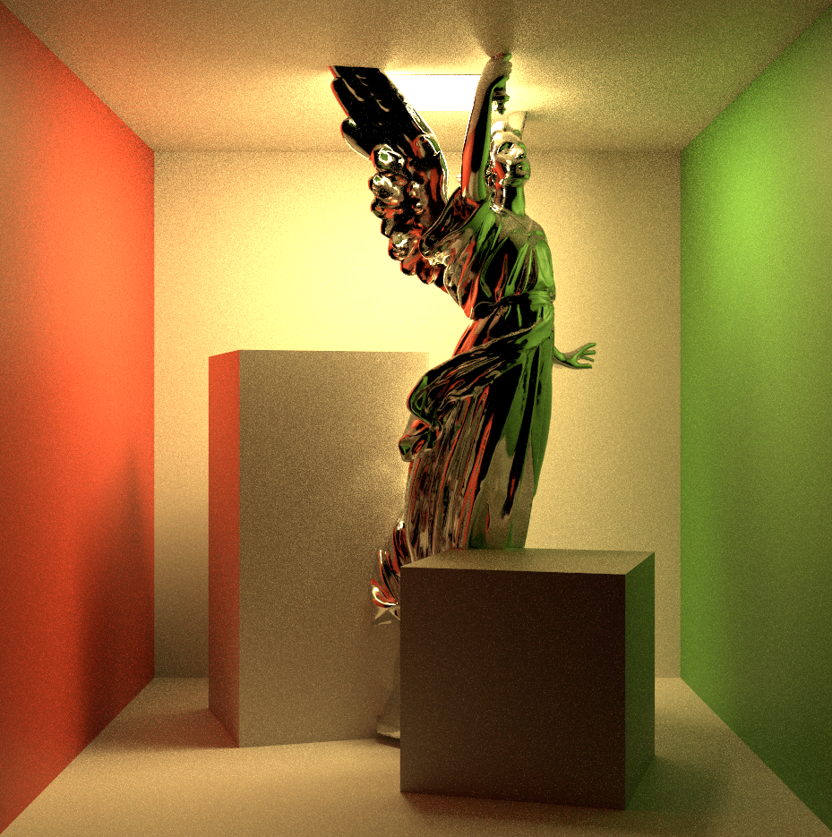

UCL CGVI 3rd Term Thesis

Light Probes with NN to deal with high frequency scenes like cautics or shadows

Tring with falcor + tiny cuda nn

---
## Abstract

In path tracing, rendering highly reflective objects is particularly challenging due to the need for rays to bounce multiple times within the scene and accumulate the results to produce the final rendering result. This process often results in noise and slow convergence rates. This thesis presents a novel approach to address these issues by leveraging deep learning to fit a reflection map field. 
    
The concept of the reflection map field is that it is able to generate the reflection map at any position within the scene. To be more specific, for any given position in space, given a ray's direction, the material properties, and the surface normal of this bounce, the proposed network should be able to predict the final rendering result corresponding to the path-traced image, accounting for multiple bounces within the scene.
       
The implementation follows a two-phase approach: In the offline phase, extension data collection is performed by simulating huge amounts of ray-object interactions with random hit information(including the material of the hit surface) within the scene. The inputs and outputs from these simulations are then used to train the deep learning model, effectively learning the reflection map field for the specific scene. During real-time rendering, the trained network is employed to predict the rendered appearance of highly reflective objects, while the traditional path tracing algorithm continues to be used for other surfaces. Extensive experiments under various conditions have validated the effectiveness of the proposed approach, demonstrating significant improvements in rendering quality.

---
## Results
| **(Metallic, Roughness)** | **GT** | **Render Result** | **Render Result (After Sharpen)** |
|---------------------------|--------|-------------------|-----------------------------------|
| **(1.0, 0.0)**             |  |  |  |
| **(0.4, 0.6)**             |  |  |  |
| **(1.0, 0.0)**             |  |  |  |
| **(0.4, 0.6)**             |  |  |  |
| **(1.0, 0.0)**             |  |  |  |
| **(0.4, 0.6)**             |  |  |  |

---
## Report
[Full Report](https://drive.google.com/file/d/1WTEwZddpIXH2OIJBBnEyLT9i7miH33rV/view?usp=drive_link).
